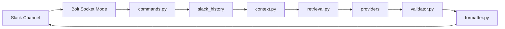

# Slack AI Agent · slack-llm-summarizer

[中文](README.md) | 日本語

[](https://www.python.org/)
[](LICENSE)

Slack **Socket Mode** ベースのチャンネル AI Agent（MVP）。チャンネルの最新メッセージとスレッドを読み取り、**構造化サマリー**・**根拠付き Q&A**・**TODO 抽出**を提供します。すべての結論は検証可能な `source_id`（例：`M1`、`T2-R1`）を引用し、プログラムが Slack パーマリンクにマッピングすることで、ハルシネーションやリンク捏造のリスクを低減します。

> 研究室・小規模チームの内部チャンネルに最適：Slack 本文を永続化せず、ローカル Socket Mode で起動、ngrok 不要。

---

## 目次

- [機能概要](#機能概要)
- [出力サンプル](#出力サンプル)
- [システムアーキテクチャ](#システムアーキテクチャ)
- [動作要件](#動作要件)
- [クイックスタート](#クイックスタート)
- [Slack App 詳細設定](#slack-app-詳細設定)
- [環境変数一覧](#環境変数一覧)
- [LLM Provider 設定](#llm-provider-設定)
- [Slack コマンドリファレンス](#slack-コマンドリファレンス)
- [ローカル開発・テスト](#ローカル開発テスト)
- [プロジェクト構成](#プロジェクト構成)
- [セキュリティとプライバシー](#セキュリティとプライバシー)
- [よくある質問 FAQ](#よくある質問-faq)
- [コントリビューション](#コントリビューション)

---

## 機能概要

| 機能 | Slash Command | 説明 |
|------|---------------|------|
| チャンネルサマリー | `/summary` | 重要な更新・決定・スケジュール/締切・TODO・未解決事項 |
| 根拠付き Q&A | `/ask` | チャンネルのメッセージのみを根拠に回答。情報不足の場合は unknown と明示 |
| TODO 抽出 | `/todo` | タスク・担当者・締切・ステータス・根拠リンク |

**App メンションにも対応：**

```text
@lab-ai-agent summary 24h
@lab-ai-agent ask 最近の demo は誰が担当？
@lab-ai-agent todo 7d
```

**コア設計：**

- Context Pipeline：クリーニング・重複排除・スレッド集約・コンテキスト切り捨て
- Keyword Retrieval（`/ask`）：ベクトルDB不要、キーワードで関連スレッドを取得
- Citation Validator：`source_id` を検証し、不正な引用は降格または除去
- マルチ LLM：`openai` / `gemini` / `deepseek` / `openai_compatible`、`.env` で切替、コマンドで一時上書き可

---

## 出力サンプル

### `/summary 24h`

```text
*AI Summary* `range:24h` `provider:deepseek`

*重要な更新*
• 金曜日までにデモを完成させる必要あり
  根拠: <permalink|M1>, <permalink|M2>
  信頼度: high

*TODO*
• [todo] Bob: backend API 完成、締切 Friday
  根拠: <permalink|M2>
  信頼度: high
```

### `/ask 最近のデモの進捗は？`

```text
*Answer*
Bob が backend を担当し、金曜日のデモ完成を目標としている。

*Evidence*
• <permalink|M2>

*Unknown / Not found*
• なし
```

---

## システムアーキテクチャ

```text
Slack /summary | /ask | /todo | @mention
        │
        ▼
  app.py (Bolt Socket Mode、先に ack してから処理)
        │
        ▼
  commands.py
        │
        ├─► slack_history.py     conversations.history + replies
        ├─► context.py           クリーニング・source_id・切り捨て
        ├─► retrieval.py         /ask キーワード検索（スレッド全文オプション）
        ├─► prompts.py           構造化 JSON プロンプト
        ├─► providers/*          LLM complete_json
        ├─► validator.py         citation 検証
        └─► formatter.py         source_id → permalink
```



---

## 動作要件

- Python **3.10+**
- Slack API にアクセス可能なネットワーク
- いずれか設定済みの LLM API（OpenAI / Gemini / DeepSeek / OpenAI 互換ゲートウェイ）
- Slack Workspace の管理者権限（App 作成・Bot インストール）

---

## クイックスタート

### 1. Clone とインストール

```powershell
git clone https://github.com/sagiri114/slack-llm-summarizer.git
cd slack-llm-summarizer

python -m venv .venv
.\.venv\Scripts\Activate.ps1

pip install -e ".[dev]"
# または: make install
# または: .\scripts\setup.ps1
```

### 2. 環境変数の設定

```powershell
Copy-Item .env.example .env
notepad .env
```

最低限、以下を記入してください：

| 変数 | 説明 |
|------|------|
| `SLACK_BOT_TOKEN` | `xoxb-...` |
| `SLACK_APP_TOKEN` | `xapp-...`（Socket Mode） |
| `LLM_PROVIDER` + 対応 API Key | [LLM Provider 設定](#llm-provider-設定) を参照 |

### 3. LLM 動作確認

```powershell
python -m slack_llm_summarizer.check_provider
# または: slack-llm-check
# または: make check
```

成功時の出力に `LLM call: OK` が含まれます。

### 4. Bot 起動

```powershell
slack-llm-summarizer
# または: make run
# または: .\scripts\dev.ps1
```

### 5. Slack でテスト

Bot を招待済みのチャンネルで実行：

```text
/summary 24h
/ask 最近の TODO は何？
/todo 7d
```

---

## Slack App 詳細設定

### 方法 A：リポジトリの Manifest を使用（推奨）

1. https://api.slack.com/apps を開く → **Create New App** → **From an app manifest**
2. Workspace を選択し、本リポジトリの `slack_app_manifest.yml` を貼り付け
3. 案内に従って作成を完了

### 方法 B：手動設定チェックリスト

- [ ] **Socket Mode**：有効化
- [ ] **App-Level Token**：scope `connections:write` → `SLACK_APP_TOKEN`
- [ ] **OAuth & Permissions** → Install App → `SLACK_BOT_TOKEN`
- [ ] **Slash Commands**：`/summary`・`/ask`・`/todo`
- [ ] **Event Subscriptions** → `app_mention`（manifest に含まれています）
- [ ] 対象チャンネルで `/invite @lab-ai-agent` を実行

### Bot Token Scopes（manifest に含まれています）

| Scope | 用途 |
|-------|------|
| `channels:history` | パブリックチャンネルの履歴取得 |
| `groups:history` | プライベートチャンネルの履歴取得 |
| `channels:read` | チャンネル情報取得 |
| `groups:read` | プライベートチャンネル情報取得 |
| `chat:write` | メッセージ送信 |
| `commands` | Slash コマンド |
| `app_mentions:read` | @メンション |
| `users:read` | ユーザー名解決 |

> MVP は DM/MPIM スコープを含みません。Bot が参加している public/private チャンネルのみ対応。

---

## 環境変数一覧

[.env.example](.env.example) を参照してください。実際のトークンを Git にコミットしないでください。

| 変数 | 必須 | デフォルト | 説明 |
|------|------|-----------|------|
| `SLACK_BOT_TOKEN` | ✅ | — | Bot OAuth Token |
| `SLACK_APP_TOKEN` | ✅ | — | Socket Mode App Token |
| `LLM_PROVIDER` | ✅ | `openai` | `openai` / `gemini` / `deepseek` / `openai_compatible` |
| `LLM_TEMPERATURE` | | `0.2` | 生成温度 |
| `LLM_MAX_TOKENS` | | `2000` | 最大出力トークン数 |
| `DEFAULT_SUMMARY_HOURS` | | `24` | `/summary` のデフォルト遡及時間 |
| `DEFAULT_ASK_HOURS` | | `168` | `/ask` のデフォルト遡及時間 |
| `DEFAULT_TODO_HOURS` | | `168` | `/todo` のデフォルト遡及時間 |
| `MAX_MESSAGES` | | `100` | 1回の取得メッセージ上限 |
| `MAX_THREAD_REPLIES` | | `20` | スレッドごとの返信上限 |
| `MAX_CONTEXT_CHARS` | | `24000` | LLM に送る文字数上限 |
| `SUMMARY_LANGUAGE` | | `zh` | 出力言語 `zh` / `en` / `ja` |
| `ALLOWED_CHANNEL_IDS` | | 空 | カンマ区切り。空=制限なし |

---

## LLM Provider 設定

### 切り替え方法

1. **デフォルト**：`.env` の `LLM_PROVIDER` を変更
2. **コマンドで一時切替**：`/summary 24h provider:deepseek`

### Provider 対応表

| Provider | API Key 変数 | Model 変数 | Base URL 変数 |
|----------|--------------|------------|---------------|
| `openai` | `OPENAI_API_KEY` | `OPENAI_MODEL` | `OPENAI_BASE_URL` |
| `gemini` | `GEMINI_API_KEY` | `GEMINI_MODEL` | （Google API 固定） |
| `deepseek` | `DEEPSEEK_API_KEY` | `DEEPSEEK_MODEL` | `DEEPSEEK_BASE_URL` |
| `openai_compatible` | `OPENAI_COMPATIBLE_API_KEY` | `OPENAI_COMPATIBLE_MODEL` | `OPENAI_COMPATIBLE_BASE_URL` |

### DeepSeek

```env
LLM_PROVIDER=deepseek
DEEPSEEK_API_KEY=
DEEPSEEK_MODEL=deepseek-chat
DEEPSEEK_BASE_URL=https://api.deepseek.com
```

### OpenAI

```env
LLM_PROVIDER=openai
OPENAI_API_KEY=
OPENAI_MODEL=gpt-4.1-mini
OPENAI_BASE_URL=https://api.openai.com/v1
```

### Gemini

```env
LLM_PROVIDER=gemini
GEMINI_API_KEY=
GEMINI_MODEL=gemini-2.0-flash
```

### OpenAI 互換（Ollama / vLLM / 内部ゲートウェイ）

```env
LLM_PROVIDER=openai_compatible
OPENAI_COMPATIBLE_API_KEY=
OPENAI_COMPATIBLE_MODEL=your-model
OPENAI_COMPATIBLE_BASE_URL=https://your-host/v1
```

---

## Slack コマンドリファレンス

### `/summary`

```text
/summary
/summary 24h
/summary 7d max:50
/summary 24h provider:deepseek
```

| パラメータ | 説明 |
|----------|------|
| `24h` / `7d` | 遡及する時間範囲 |
| `max:100` | 取得するメッセージの最大数 |
| `provider:xxx` | 一時的な LLM provider 切替 |

### `/ask`

```text
/ask 最近のデモの進捗は？
/ask provider:gemini 誰がフロントエンドを担当している？ 7d
```

### `/todo`

```text
/todo
/todo 7d
/todo 24h provider:openai
```

---

## ローカル開発・テスト

### Makefile / スクリプト

| コマンド | 内容 |
|---------|------|
| `make install` | `pip install -e ".[dev]"` |
| `make setup` | `.env.example` → `.env` にコピー |
| `make run` | Bot 起動 |
| `make test` | pytest 実行 |
| `make check` | LLM 設定の診断 |
| `.\scripts\setup.ps1` | Windows 一括インストール |
| `.\scripts\dev.ps1` | Windows 起動 |

### テスト実行

```powershell
make test
# または: pytest -q
```

### Slack なしでの Dry Run

```powershell
slack-summary-dry-run --input samples/messages.json --provider deepseek
```

---

## プロジェクト構成

```text
slack-llm-summarizer/
├── slack_app_manifest.yml    # Slack App マニフェスト
├── .env.example              # 環境変数テンプレート（secret なし）
├── pyproject.toml
├── requirements.txt
├── Makefile
├── scripts/
│   ├── setup.ps1 / setup.sh
│   └── dev.ps1
├── samples/
│   └── messages.json         # dry-run サンプル
├── src/slack_llm_summarizer/
│   ├── app.py
│   ├── config.py
│   ├── startup.py
│   ├── commands.py
│   ├── context.py
│   ├── retrieval.py
│   ├── prompts.py
│   ├── formatter.py
│   ├── validator.py
│   ├── check_provider.py
│   └── providers/
└── tests/
```

---

## セキュリティとプライバシー

- ✅ すべての secret は**環境変数からのみ**読み込まれます
- ✅ `.env` は `.gitignore` に追加済み。リポジトリには空値の `.env.example` のみ含まれます
- ✅ 起動ログおよび Slack エラーに API Key / Token は**出力されません**
- ✅ モデルは `source_id` のみ出力し、パーマリンクはプログラムが生成します
- ✅ Slack 本文をデータベースに永続化しません（メモリ内処理のみ）
- ⚠️ LLM 呼び出し時にチャンネルのコンテキストが該当 API に送信されます。社内・チーム内でコンプライアンスに準拠してご利用ください
- ⚠️ 本番環境では `ALLOWED_CHANNEL_IDS` の設定を推奨します

---

## よくある質問 FAQ

<details>
<summary><b>起動失敗：SLACK_BOT_TOKEN が見つかりません</b></summary>

Slack App → **OAuth & Permissions** → **Install to Workspace** → Bot User OAuth Token（`xoxb-...`）をコピーして `.env` に貼り付けてください。
</details>

<details>
<summary><b>起動失敗：SLACK_APP_TOKEN が見つかりません</b></summary>

**Socket Mode** を有効化した後、**App-Level Tokens** でトークンを作成し、scope に `connections:write` を選択してください。
</details>

<details>
<summary><b>Bot が「処理に失敗しました」と返答する</b></summary>

1. `LLM_PROVIDER` と API Key が一致しているか確認（例：DeepSeek は `LLM_PROVIDER=deepseek`）
2. `python -m slack_llm_summarizer.check_provider` を実行
3. ターミナルの完全なログを確認（secret は含まれません）
</details>

<details>
<summary><b>分析できるメッセージがありません</b></summary>

- Bot がチャンネルに `/invite` されているか確認
- `/summary 7d` で時間範囲を広げてみてください
</details>

<details>
<summary><b>ModuleNotFoundError: aiohttp</b></summary>

```powershell
pip install -e .
```
</details>

<details>
<summary><b>不明な provider: foo</b></summary>

使用可能：`openai`, `gemini`, `deepseek`, `openai_compatible`。例：`provider:deepseek`
</details>

---

## コントリビューション

1. 本リポジトリを Fork
2. ブランチを作成：`git checkout -b feature/your-feature`
3. 変更をコミットし、`make test` が通ることを確認
4. Pull Request を作成

---

## 参考リンク

- [Slack Socket Mode](https://docs.slack.dev/apis/events-api/using-socket-mode/)
- [Slack conversations.history](https://docs.slack.dev/reference/methods/conversations.history/)
- [DeepSeek API](https://api-docs.deepseek.com/)
- [OpenAI Chat Completions](https://platform.openai.com/docs/api-reference/chat/create)

---

## 出力のカスタマイズ

出力言語は `.env` の `SUMMARY_LANGUAGE` で制御します：

```env
SUMMARY_LANGUAGE=ja
# または
SUMMARY_LANGUAGE=zh
```

`/summary` は LLM により詳細な構造を要求し、Slack に以下を表示します：

- 主要な結論
- 詳細
- 影響
- 次のステップ
- 根拠
- 信頼度

より長い出力が必要な場合は以下も合わせて調整してください：

```env
LLM_MAX_TOKENS=4000
MAX_MESSAGES=200
MAX_CONTEXT_CHARS=40000
```

---

## License

MIT（リポジトリに LICENSE ファイルが含まれていない場合は、別途追加してください。）
