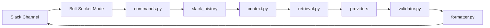

# Slack AI Agent · slack-llm-summarizer

[](https://www.python.org/)
[](LICENSE)

基于 Slack **Socket Mode** 的频道 AI Agent（MVP）。读取频道最近消息与 thread，提供**结构化总结**、**证据约束问答**与 **TODO 提取**。所有结论必须引用可验证的 `source_id`（如 `M1`、`T2-R1`），由程序映射为 Slack permalink，降低幻觉与编造链接的风险。

> 适合研究室 / 小团队内部频道：不持久化 Slack 原文，本地 Socket Mode 启动，无需 ngrok。

---

## 目录

- [功能概览](#功能概览)
- [输出示例](#输出示例)
- [系统架构](#系统架构)
- [环境要求](#环境要求)
- [Quick Start](#quick-start)
- [Slack App 详细配置](#slack-app-详细配置)
- [环境变量完整说明](#环境变量完整说明)
- [LLM Provider 配置](#llm-provider-配置)
- [Slack 命令参考](#slack-命令参考)
- [本地开发与测试](#本地开发与测试)
- [项目结构](#项目结构)
- [安全与隐私](#安全与隐私)
- [常见问题 FAQ](#常见问题-faq)
- [参与贡献](#参与贡献)

---

## 功能概览

| 能力 | Slash Command | 说明 |
|------|---------------|------|
| 频道总结 | `/summary` | 重要更新、决定、日程/截止、TODO、未解决问题 |
| 证据问答 | `/ask` | 仅根据频道消息回答；不足则标明 unknown |
| TODO 提取 | `/todo` | 任务、负责人、截止时间、状态、证据链接 |

**也支持 App Mention：**

```text
@lab-ai-agent summary 24h
@lab-ai-agent ask 最近 demo 谁负责？
@lab-ai-agent todo 7d
```

**核心设计：**

- Context Pipeline：清洗、去重、thread 聚合、上下文截断
- Keyword Retrieval（`/ask`）：无向量库，按关键词拉取相关 thread
- Citation Validator：校验 `source_id`，非法引用降级或剔除
- 多 LLM：`openai` / `gemini` / `deepseek` / `openai_compatible`，`.env` 切换，命令可临时覆盖

---

## 输出示例

### `/summary 24h`

```text
AI Summary* `range:24h` `provider:deepseek`

*重要更新*
• 周五前需要完成 demo
  证据: <permalink|M1>, <permalink|M2>
  置信度: high

*TODO*
• [todo] Bob: 完成 backend API，截止 Friday
  证据: <permalink|M2>
  置信度: high
```

### `/ask 最近 demo 的进展是什么？`

```text
*Answer*
Bob 负责 backend，目标周五完成 demo。

*Evidence*
• <permalink|M2>

*Unknown / Not found*
• 无
```

---

## 系统架构

```text
Slack /summary | /ask | /todo | @mention
        │
        ▼
  app.py (Bolt Socket Mode，先 ack 再处理)
        │
        ▼
  commands.py
        │
        ├─► slack_history.py     conversations.history + replies
        ├─► context.py             清洗、source_id、截断
        ├─► retrieval.py           /ask 关键词检索（可选整 thread）
        ├─► prompts.py             结构化 JSON prompt
        ├─► providers/*            LLM complete_json
        ├─► validator.py           citation 校验
        └─► formatter.py             source_id → permalink
```



---

## 环境要求

- Python **3.10+**
- 可访问 Slack API 的网络
- 任一已配置的 LLM API（OpenAI / Gemini / DeepSeek / OpenAI 兼容网关）
- Slack Workspace 管理员权限（创建 App、安装 Bot）

---

## Quick Start

### 1. Clone 与安装

```powershell
git clone https://github.com/sagiri114/slack-llm-summarizer.git
cd slack-llm-summarizer

python -m venv .venv
.\.venv\Scripts\Activate.ps1

pip install -e ".[dev]"
# 或: make install
# 或: .\scripts\setup.ps1
```

### 2. 配置环境变量

```powershell
Copy-Item .env.example .env
notepad .env
```

至少填写：

| 变量 | 说明 |
|------|------|
| `SLACK_BOT_TOKEN` | `xoxb-...` |
| `SLACK_APP_TOKEN` | `xapp-...`（Socket Mode） |
| `LLM_PROVIDER` + 对应 API Key | 见 [LLM Provider 配置](#llm-provider-配置) |

### 3. 验证 LLM

```powershell
python -m slack_llm_summarizer.check_provider
# 或: slack-llm-check
# 或: make check
```

成功输出应包含 `LLM call: OK`。

### 4. 启动 Bot

```powershell
slack-llm-summarizer
# 或: make run
# 或: .\scripts\dev.ps1
```

### 5. Slack 内测试

在已邀请 bot 的频道执行：

```text
/summary 24h
/ask 最近有什么待办？
/todo 7d
```

---

## Slack App 详细配置

### 方式 A：使用仓库 Manifest（推荐）

1. 打开 https://api.slack.com/apps → **Create New App** → **From an app manifest**
2. 选择 Workspace，粘贴本仓库 `slack_app_manifest.yml`
3. 按提示完成创建

### 方式 B：手动配置 checklist

- [ ] **Socket Mode**：开启
- [ ] **App-Level Token**：scope `connections:write` → `SLACK_APP_TOKEN`
- [ ] **OAuth & Permissions** → Install App → `SLACK_BOT_TOKEN`
- [ ] **Slash Commands**：`/summary`、`/ask`、`/todo`
- [ ] **Event Subscriptions** → `app_mention`（manifest 已含）
- [ ] 目标频道执行 `/invite @lab-ai-agent`

### Bot Token Scopes（manifest 已包含）

| Scope | 用途 |
|-------|------|
| `channels:history` | 读取公开频道历史 |
| `groups:history` | 读取私有频道历史 |
| `channels:read` | 频道信息 |
| `groups:read` | 私有频道信息 |
| `chat:write` | 发送消息 |
| `commands` | Slash commands |
| `app_mentions:read` | @mention |
| `users:read` | 解析用户名 |

> MVP **不包含** DM/MPIM scope，仅支持 bot 已加入的 public/private channel。

---

## 环境变量完整说明

参见 [.env.example](.env.example)。**切勿**将真实 token 提交到 Git。

| 变量 | 必填 | 默认值 | 说明 |
|------|------|--------|------|
| `SLACK_BOT_TOKEN` | ✅ | — | Bot OAuth Token |
| `SLACK_APP_TOKEN` | ✅ | — | Socket Mode App Token |
| `LLM_PROVIDER` | ✅ | `openai` | `openai` / `gemini` / `deepseek` / `openai_compatible` |
| `LLM_TEMPERATURE` | | `0.2` | 生成温度 |
| `LLM_MAX_TOKENS` | | `2000` | 最大输出 token |
| `DEFAULT_SUMMARY_HOURS` | | `24` | `/summary` 默认回溯小时 |
| `DEFAULT_ASK_HOURS` | | `168` | `/ask` 默认回溯小时 |
| `DEFAULT_TODO_HOURS` | | `168` | `/todo` 默认回溯小时 |
| `MAX_MESSAGES` | | `100` | 单次拉取消息上限 |
| `MAX_THREAD_REPLIES` | | `20` | 每 thread 回复上限 |
| `MAX_CONTEXT_CHARS` | | `24000` | 送入 LLM 的字符上限 |
| `SUMMARY_LANGUAGE` | | `zh` | 输出语言 `zh` / `en` / `ja` |
| `ALLOWED_CHANNEL_IDS` | | 空 | 逗号分隔；空=不限制 |

---

## LLM Provider 配置

### 切换方式

1. **默认**：修改 `.env` 中 `LLM_PROVIDER`
2. **单次命令**：`/summary 24h provider:deepseek`

### Provider 对照表

| Provider | API Key 变量 | Model 变量 | Base URL 变量 |
|----------|--------------|------------|---------------|
| `openai` | `OPENAI_API_KEY` | `OPENAI_MODEL` | `OPENAI_BASE_URL` |
| `gemini` | `GEMINI_API_KEY` | `GEMINI_MODEL` | （固定 Google API） |
| `deepseek` | `DEEPSEEK_API_KEY` | `DEEPSEEK_MODEL` | `DEEPSEEK_BASE_URL` |
| `openai_compatible` | `OPENAI_COMPATIBLE_API_KEY` | `OPENAI_COMPATIBLE_MODEL` | `OPENAI_COMPATIBLE_BASE_URL` |

### DeepSeek（国内常用）

```env
LLM_PROVIDER=deepseek
DEEPSEEK_API_KEY=
DEEPSEEK_MODEL=deepseek-chat
DEEPSEEK_BASE_URL=https://api.deepseek.com
```

### OpenAI

```env
LLM_PROVIDER=openai
OPENAI_API_KEY=
OPENAI_MODEL=gpt-4.1-mini
OPENAI_BASE_URL=https://api.openai.com/v1
```

### Gemini

```env
LLM_PROVIDER=gemini
GEMINI_API_KEY=
GEMINI_MODEL=gemini-2.0-flash
```

### OpenAI 兼容（Ollama / vLLM / 内网网关）

```env
LLM_PROVIDER=openai_compatible
OPENAI_COMPATIBLE_API_KEY=
OPENAI_COMPATIBLE_MODEL=your-model
OPENAI_COMPATIBLE_BASE_URL=https://your-host/v1
```

---

## Slack 命令参考

### `/summary`

```text
/summary
/summary 24h
/summary 7d max:50
/summary 24h provider:deepseek
```

| 参数 | 说明 |
|------|------|
| `24h` / `7d` | 回溯时间范围 |
| `max:100` | 最多拉取消息数 |
| `provider:xxx` | 临时 LLM provider |

### `/ask`

```text
/ask 最近 demo 的进展是什么？
/ask provider:gemini 谁负责前端？ 7d
```

### `/todo`

```text
/todo
/todo 7d
/todo 24h provider:openai
```

---

## 本地开发与测试

### Makefile / 脚本

| 命令 | 作用 |
|------|------|
| `make install` | `pip install -e ".[dev]"` |
| `make setup` | 复制 `.env.example` → `.env` |
| `make run` | 启动 bot |
| `make test` | pytest |
| `make check` | LLM 配置诊断 |
| `.\scripts\setup.ps1` | Windows 一键安装 |
| `.\scripts\dev.ps1` | Windows 启动 |

### 运行测试

```powershell
make test
# 或: pytest -q
```

### 无 Slack 的 Dry Run

```powershell
slack-summary-dry-run --input samples/messages.json --provider deepseek
```

---

## 项目结构

```text
slack-llm-summarizer/
├── slack_app_manifest.yml    # Slack App manifest
├── .env.example              # 环境变量模板（无 secret）
├── pyproject.toml
├── requirements.txt
├── Makefile
├── scripts/
│   ├── setup.ps1 / setup.sh
│   └── dev.ps1
├── samples/
│   └── messages.json         # dry-run 样例
├── src/slack_llm_summarizer/
│   ├── app.py
│   ├── config.py
│   ├── startup.py
│   ├── commands.py
│   ├── context.py
│   ├── retrieval.py
│   ├── prompts.py
│   ├── formatter.py
│   ├── validator.py
│   ├── check_provider.py
│   └── providers/
└── tests/
```

---

## 安全与隐私

- ✅ 所有 secret **仅**从环境变量读取
- ✅ `.env` 已加入 `.gitignore`，仓库只含 `.env.example` 空值
- ✅ 启动日志与 Slack 错误**不**打印 API Key / Token
- ✅ 模型只输出 `source_id`，permalink 由程序生成
- ✅ 不在数据库持久化 Slack 全文（仅内存处理）
- ⚠️ 调用 LLM 时会把频道上下文发送至对应 API，请在内网/团队内合规使用
- ⚠️ 生产环境建议设置 `ALLOWED_CHANNEL_IDS`

---

## 常见问题 FAQ

<details>
<summary><b>启动失败：缺少 SLACK_BOT_TOKEN</b></summary>

Slack App → **OAuth & Permissions** → **Install to Workspace** → 复制 Bot User OAuth Token（`xoxb-...`）到 `.env`。
</details>

<details>
<summary><b>启动失败：缺少 SLACK_APP_TOKEN</b></summary>

**Socket Mode** 开启后，在 **App-Level Tokens** 创建 token，scope 勾选 `connections:write`。
</details>

<details>
<summary><b>Bot 回复「处理失败」</b></summary>

1. 确认 `LLM_PROVIDER` 与 API Key 匹配（例如 DeepSeek 用 `LLM_PROVIDER=deepseek`）
2. 运行 `python -m slack_llm_summarizer.check_provider`
3. 查看终端完整日志（不会含 secret）
</details>

<details>
<summary><b>没有可分析的消息</b></summary>

- bot 是否已 `/invite` 进频道
- 尝试 `/summary 7d` 扩大时间范围
</details>

<details>
<summary><b>ModuleNotFoundError: aiohttp</b></summary>

```powershell
pip install -e .
```
</details>

<details>
<summary><b>未知的 provider: foo</b></summary>

可用：`openai`, `gemini`, `deepseek`, `openai_compatible`。示例：`provider:deepseek`。
</details>

---

## 参与贡献

1. Fork 本仓库
2. 创建分支：`git checkout -b feature/your-feature`
3. 提交改动并确保 `make test` 通过
4. 发起 Pull Request

---

## 参考链接

- [Slack Socket Mode](https://docs.slack.dev/apis/events-api/using-socket-mode/)
- [Slack conversations.history](https://docs.slack.dev/reference/methods/conversations.history/)
- [DeepSeek API](https://api-docs.deepseek.com/)
- [OpenAI Chat Completions](https://platform.openai.com/docs/api-reference/chat/create)

---

## License

MIT（如仓库未包含 LICENSE 文件，可自行添加。）
